# Termo-Light: Sensores para controle de ambiente em laboratórios

# Manual do Usuário
Este manual descreve o funcionamento do Termo-Light, um dispositivo que monitora temperatura, umidade e intensidade de luz e emite alertas sonoros e visuais quando os valores excedem os limites pré-definidos.

É um dispositivo desenvolvido com a missão de melhorar o controle de variáveis em laboratório.

## Componentes

| Componente                     | Imagem                                         | Quantidade |
|---------------------------------|------------------------------------------------|------------|
| Arduino UNO                     | 
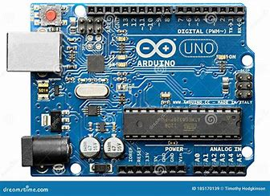
       | 1          |
| Sensor de temperatura e umidade DHT22 | 
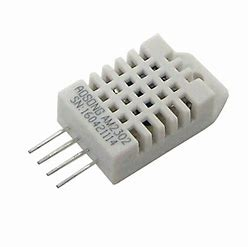
 | 1          |
| Sensor de luz LDR               | 
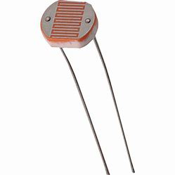
         | 1          |
| Buzzer                          | 
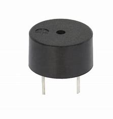
                 | 1          |
| LED RGB                         | 
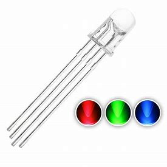
               | 1          |
| LCD I2C 16x2                    | 
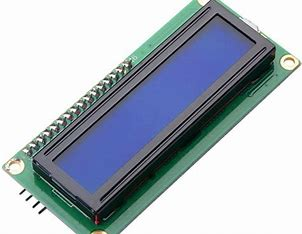
     | 1          |
| Botões                          | 
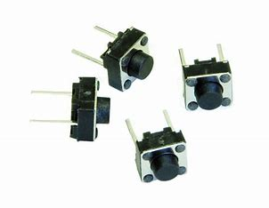
                 | 3          |
| Relógio de Tempo Real RTC DS3231 | 
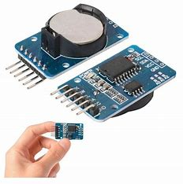
 | 1          |
| Placa de prototipagem            | 
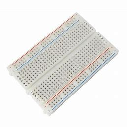
   | 1          |
| Resistores                      | 
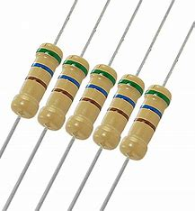
         | 6          |
| Cabos de ligação (Jumpers)       | 
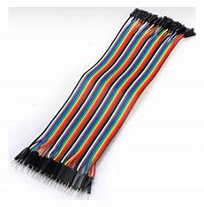
 | Vários     |

## Conexões

| **Componente**   | **Conexões** |
|------------------|--------------|
| **DHT22**        | - Pino de Dados (DHT22) -> Pino Digital 8 (Arduino UNO)   - VCC (DHT22) -> 5V (Arduino UNO)   - GND (DHT22) -> GND (Arduino UNO) |
| **LDR**          | - Pino de saída (LDR) -> A0 (Arduino UNO) |
| **Buzzer**       | - Pino de saída (Buzzer) -> Pino Digital 9 (Arduino UNO) |
| **LED RGB**      | - Vermelho (LED RGB) -> Pino Digital 7 (Arduino UNO)   - Verde (LED RGB) -> Pino Digital 6 (Arduino UNO)   - Azul (LED RGB) -> Pino Digital 5 (Arduino UNO) |
| **Botões**       | - Botão 1 -> Pino Digital 13 (Arduino UNO)   - Botão 2 -> Pino Digital 12 (Arduino UNO)   - Botão 3 -> Pino Digital 11 (Arduino UNO) |
| **RTC**          | - SDA (RTC) -> SDA (Arduino UNO)   - SCL (RTC) -> SCL (Arduino UNO)   - VCC (RTC) -> 5V (Arduino UNO)   - GND (RTC) -> GND (Arduino UNO) |
| **LCD**          | - SDA (LCD) -> SDA (Arduino UNO)   - SCL (LCD) -> SCL (Arduino UNO)   - VCC (LCD) -> 5V (Arduino UNO)   - GND (LCD) -> GND (Arduino UNO) |

# Diagrama elétrico
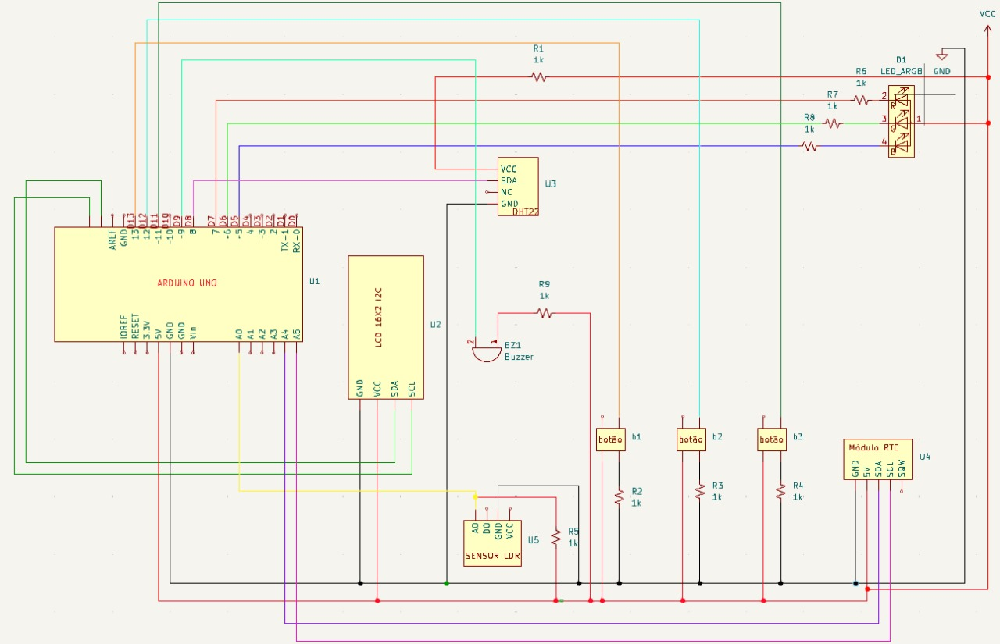

# Configuração Inicial:
1. Conecte a bateria de 9 volts ao Arduino UNO.
2. Ligue o dispositivo.
3. O LCD mostrará a tela de introdução.
4. A luz verde do LED RGB acenderá, indicando que o dispositivo está pronto.

# Navegação pelas Telas:
- **Botão 1 (Pino 13)**: Troca entre as telas de temperatura, umidade, luz e tempo.
- **Botão 2 (Pino 12)**: Ajusta a unidade de medida da temperatura.
- **Botão 3 (Pino 11)**: Troca o tom do buzzer.

## Telas de Monitoramento:
- **Tela de Temperatura**:
    - Mostra a temperatura atual na unidade de medida selecionada (graus Celsius, Fahrenheit ou Kelvin).
- **Tela de Umidade**:
    - Mostra a umidade relativa atual.
- **Tela de Luz**:
    - Mostra a intensidade de luz em porcentagem (0-100).
- **Tela de Tempo**:
    - Mostra a data e hora atuais.

# Alertas:
- **Buzzer**: Toca um sinal sonoro quando os valores de temperatura, umidade ou luz excedem os limites pré-definidos.
- **LED RGB**: Mudará para vermelho quando os valores de temperatura, umidade ou luz excedem os limites pré-definidos.

## Limites Pré-Definidos:
- **Temperatura**: 15 - 25 graus Celsius
- **Umidade**: 30 - 50%
- **Luz**: 0.1 - 30%

## Especificações
Para garantir a qualidade do insumo farmacêutico durante o armazenamento e transporte, é necessário um sensor que monitore luz, umidade e temperatura, evitando condições que possam comprometer a sua integridade, em especial, do princípio ativo. 
As especificações são projetadas para garantir a detecção precisa de condições adversas, protegendo a qualidade de insumos durante toda a cadeia de armazenamento e transporte. Sendo assim, importante armazenar dados da variação desses fatores e o tempo para que futuras correções sejam realizadas na cadeia de armazenamento e transporte.
As faixas de triggers podem ser alteradas através do código, caso necessário, dependendo das especificações de transporte e armazenamento tanto do país quanto do insumo.
Segue abaixo as especificações atuais do sensor:

1. Faixa de Medição de Luz:
   - Tipo de luz: visível 
   - Faixa de medição: 0 a 100% de luminosidade que é calculada através da resistência (adequado para monitorar ambientes internos e possíveis exposições a fontes de luz intensa).
   - Faixa do trigger: de 0,1 a 30%.

2. Faixa de Medição de Umidade:
   - Faixa de umidade relativa: 0 a 100% (especialmente importante para detectar pequenos aumentos que podem causar hidrólise ou até mesmo favorecer o crescimento de seres vivos contaminantes).
   - Faixa do trigger: de 30% a 50% de umidade.

3. Faixa de Medição de Temperatura:
   - Faixa de temperatura: 0°C a 50°C (adequado para diversas condições de armazenamento e transporte).
   - Faixa do trigger: de 15 a 25ºC.

4. Características de Comunicação:
   - Protocolo de comunicação: USB (para integração com sistemas de monitoramento).
   - Interface: Display LCD I2C para exibição de dados e status para leitura dos valores.
   - Alarmes: Notificações sonoras(buzzer) e visuais para alertar sobre condições fora dos limites pré-estabelecidos.

5. Condições Operacionais:
   - Temperatura de operação: 0°C a 50°C.
   - Umidade de operação: 0 a 95% UR, sem condensação.
   - Resistência a contaminantes: Proteção contra poeira e respingos (Futuramente colocar todo o sistema em uma caixa).

6. Alimentação:
   - Fonte de energia: Bateria de 9V ou alimentação por cabo USB.

7. Calibração e Manutenção:
   - Software: Compatibilidade com software de monitoramento para registro de dados e análise histórica.

8. Dimensões e Instalação:
   - Tamanho: Compacto (cerca de 20 x 14 x 10 cm).
   - Método de instalação: Montagem em laboratórios e enviadas para ficarem em estantes de armazenamento.

9. Armazenamento de Dados:
   - Capacidade de registro: Armazenamento interno de dados na memória EEPROM com possibilidade de exportação para análise posterior.

# Aviso:
- Mantenha o dispositivo em um local seguro e seco.
- Não deixe o dispositivo exposto à água ou a altas temperaturas.

# Informações Adicionais:
- O Termo-Light salva os valores de alarme e os últimos eventos de alerta na memória.
- Ao reiniciar o dispositivo, ele carrega os dados salvos da memória.
- Para restaurar as configurações padrão, remova o dispositivo da fonte de alimentação e ligue-o novamente.
- Para utilizar o dispositivo com um computador, conecte-o ao computador via USB.
- Para usar o código original, basta conectar o Arduino UNO ao computador via USB e fazer o upload do código no Arduino IDE.
- Não retirar nenhum componente, todos são essenciais para o funcionamento.

---

# 
Aproveite seu Termo-Light!

